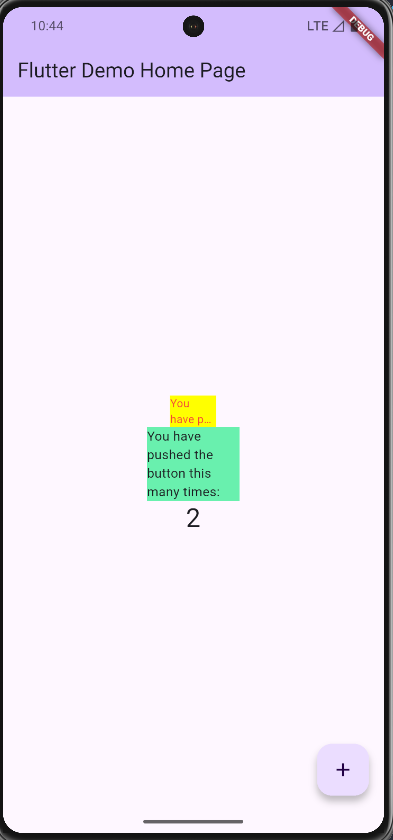

# 🧩 Praktikum: Menerapkan Plugin di Project Flutter

## 📘 Deskripsi Singkat

Project ini merupakan hasil praktikum mata kuliah _Pemrograman Mobile_ dengan tujuan mempelajari cara menambahkan dan menggunakan **plugin dari pub.dev** ke dalam project Flutter.
Plugin yang digunakan adalah [`auto_size_text`](https://pub.dev/packages/auto_size_text), yang berfungsi untuk menyesuaikan ukuran teks secara otomatis agar sesuai dengan batas ruang (_container_) yang tersedia.

Repository: [https://github.com/afgangalih/flutter_plugin_pubdev](https://github.com/afgangalih/flutter_plugin_pubdev)

---

## ⚙️ Langkah-langkah Praktikum

1. Membuat project baru `flutter_plugin_pubdev`
2. Menambahkan plugin `auto_size_text`
3. Membuat file `red_text_widget.dart`
4. Menggunakan widget `AutoSizeText` di dalam `RedTextWidget`
5. Menambahkan parameter `text` di konstruktor `RedTextWidget`
6. Menampilkan widget pada file `main.dart`

---

## 🖼️ Dokumentasi

Berikut hasil tampilan saat aplikasi dijalankan:



Keterangan:

- Container **kuning** menggunakan widget `RedTextWidget` dengan teks berwarna merah yang otomatis menyesuaikan ukuran.
- Container **hijau** menggunakan widget `Text` biasa untuk pembanding.

---

## 💬 Jawaban Pertanyaan

### 1️⃣ Maksud dari Langkah 2

Langkah 2 menambahkan plugin `auto_size_text` dari situs [pub.dev](https://pub.dev).
Perintah `flutter pub add auto_size_text` secara otomatis menambahkan dependensi plugin tersebut ke file `pubspec.yaml` pada bagian `dependencies`.
Plugin ini berfungsi untuk membuat teks menyesuaikan ukuran secara otomatis agar muat di dalam batas ruang (misalnya container dengan lebar terbatas).

---

### 2️⃣ Maksud dari Langkah 5

Langkah 5 menambahkan variabel:

```dart
final String text;
```

dan parameter pada konstruktor:

```dart
const RedTextWidget({Key? key, required this.text}) : super(key: key);
```

Tujuannya agar widget `RedTextWidget` dapat menerima input teks dari luar (seperti dari `main.dart`).
Tanpa variabel dan parameter ini, kode `text` di dalam `AutoSizeText(text, ...)` akan menghasilkan error karena belum terdefinisi.

---

### 3️⃣ Fungsi dan Perbedaan Dua Widget pada Langkah 6

| Widget          | Warna  | Fungsi                                                            | Keterangan                          |
| --------------- | ------ | ----------------------------------------------------------------- | ----------------------------------- |
| `RedTextWidget` | Kuning | Menampilkan teks berwarna merah yang otomatis menyesuaikan ukuran | Menggunakan plugin `auto_size_text` |
| `Text`          | Hijau  | Menampilkan teks biasa tanpa penyesuaian ukuran otomatis          | Menggunakan widget bawaan Flutter   |

Perbedaannya adalah `AutoSizeText` (di dalam `RedTextWidget`) mampu mengecilkan ukuran font agar seluruh teks muat dalam container, sedangkan `Text` biasa tidak menyesuaikan ukuran secara otomatis.

---

### 4️⃣ Penjelasan Parameter Plugin `auto_size_text`

Berikut beberapa parameter penting dari plugin `auto_size_text` beserta fungsinya:

| Parameter             | Fungsi                                                                                     |
| --------------------- | ------------------------------------------------------------------------------------------ |
| `text`                | Isi teks yang akan ditampilkan.                                                            |
| `style`               | Menentukan gaya teks (warna, ukuran, ketebalan, dsb).                                      |
| `maxLines`            | Batas jumlah baris teks yang boleh ditampilkan. Jika lebih, teks dipotong dengan overflow. |
| `minFontSize`         | Ukuran font terkecil yang diizinkan untuk teks agar tetap bisa terbaca. Default: 12.       |
| `maxFontSize`         | Ukuran font terbesar yang diizinkan agar tidak terlalu besar.                              |
| `overflow`            | Menentukan perilaku ketika teks melebihi batas (misalnya `TextOverflow.ellipsis`).         |
| `group`               | Mengelompokkan beberapa `AutoSizeText` agar semua punya ukuran font yang seragam.          |
| `stepGranularity`     | Menentukan langkah penurunan ukuran font saat menyesuaikan ukuran teks.                    |
| `presetFontSizes`     | Menentukan daftar ukuran font yang boleh digunakan.                                        |
| `overflowReplacement` | Widget pengganti jika teks tidak muat meskipun sudah diubah ukurannya.                     |

---

## ✅ Kesimpulan

Dari praktikum ini, dapat dipahami bahwa:

- Plugin dari pub.dev dapat memperluas kemampuan Flutter tanpa harus membuat kode dari nol.
- `auto_size_text` sangat berguna untuk tampilan responsif dan efisien.
- Penting untuk memahami parameter yang ada agar teks tampil optimal di berbagai ukuran layar.

---

**Dibuat oleh:**
🧑‍💻 _Afgan Galih Fauz Amjad Amadinah - 2341760004_

**Dibuat oleh:**
absen: 9 oktober